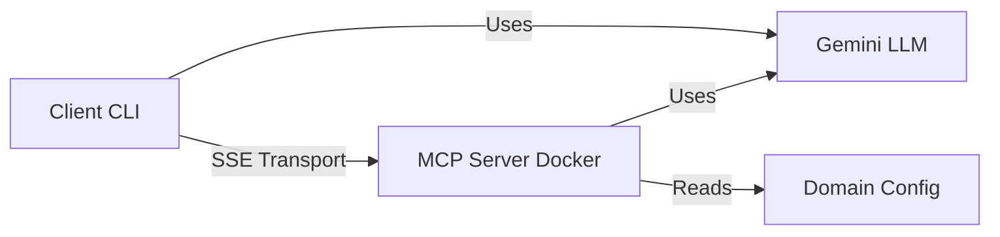

# MCP Workflow Generator

An MCP (Model Context Protocol) server and client for generating, validating, and exporting workflow blueprints using Gemini LLM.

## 🏗️ Architecture



## 📋 Prerequisites

- Node.js 18+
- Docker & Docker Compose
- Gemini API Key ([Get one here](https://ai.google.dev/))

---

## 🚀 Quick Start

### Server Setup

#### 1. Navigate to server directory
```bash
cd server/
```

#### 2. Configure domain and environment

**Option A: Use existing config**
```bash
# Available configs in server/config/:
# - default.json (generic workflows)
# - healthcare.json (medical workflows)
# - ecommerce.json (shopping workflows)
```

**Option B: Create custom config**

Create `server/config/my-domain.json`:
```json
{
  "domain": "my-domain",
  "stepTypes": [
    { "type": "start", "description": "Start event" },
    { "type": "end", "description": "End event" },
    { "type": "task", "description": "Generic task" },
    { "type": "custom-step", "description": "Your custom step" }
  ],
  "actors": [
    { "id": "user", "name": "User" },
    { "id": "system", "name": "System" }
  ]
}
```

#### 3. Create `.env` file
```bash
# server/.env
DOMAIN_CONFIG_PATH=config/healthcare.json
GEMINI_API_KEY=your_gemini_api_key_here
```

#### 4. Build and start server
```bash
npm run build
docker compose up -d --build
```

#### 5. Get server URL
```bash
# Server runs at:
http://localhost:3000

# Check logs:
docker compose logs -f
```

---

### Client Setup

#### 1. Navigate to client directory
```bash
cd client/
```

#### 2. Create `.env` file
```bash
# client/.env
GEMINI_API_KEY=your_gemini_api_key_here
MCP_SERVER_URL=http://localhost:3000/sse
```

#### 3. Build and start client
```bash
npm run build && npm start
```

---

## 💬 Sample Prompts

Once the client starts, try these prompts:

### Getting Started
```
What tools are available?
```

### Healthcare Domain (if using healthcare.json)
```
Generate a patient admission workflow
```
```
Create a workflow for emergency room triage
```
```
Build a prescription refill process
```

### E-commerce Domain (if using ecommerce.json)
```
Generate a checkout workflow
```
```
Create an order fulfillment process
```
```
Build a return and refund workflow
```

### Generic Workflows (default.json)
```
Generate a user authentication workflow with login and logout
```
```
Create an approval workflow with multiple reviewers
```
```
Build a data processing pipeline
```

### Validation & Export
```
Validate the workflow I just created
```
```
Export the last workflow to BPMN format
```
```
Convert the workflow to Mermaid diagram
```
```
Show me the workflow in YAML format
```

### Server Information
```
Get server info
```
```
What resources are available?
```

---

## 🛑 Stopping the Application

### Stop Client
```
exit
```
(or press `Ctrl+C`)

### Stop Server
```bash
cd server/
docker compose down
```

---

## 🧪 Testing Without Gemini

To test MCP functionality directly without using Gemini quota:

```bash
cd client/
npm test
```

This runs automated tests that call MCP tools directly.

---

## 📁 Project Structure

```
mcp-anti-workflow/
├── server/
│   ├── config/           # Domain configurations
│   ├── src/
│   │   ├── tools/        # MCP tools (generate, validate, export)
│   │   ├── services/     # Gemini service
│   │   └── resources/    # MCP resources
│   ├── Dockerfile
│   ├── docker-compose.yml
│   └── .env             # Server environment variables
│
└── client/
    ├── src/
    │   ├── index.ts     # Interactive Gemini-powered CLI
    │   └── test.ts      # Direct MCP testing
    └── .env             # Client environment variables
```

---

## 🔧 Available MCP Tools

| Tool | Description | Arguments |
|------|-------------|-----------|
| `generate_workflow_spec` | Generate workflow from description | `description`, `domain`, `format` |
| `validate_workflow` | Validate workflow structure | `workflow_content`, `format` |
| `export_to_format` | Convert workflow formats | `workflow_content`, `source_format`, `target_format` |
| `get_server_info` | Get server information | None |

## 📦 Available Resources

| Resource | Description |
|----------|-------------|
| `step-types` | Available workflow step types |
| `actors` | Available workflow actors/roles |
| `templates` | Available workflow templates |

---

## 🐛 Troubleshooting

### Server won't start
```bash
# Check if port 3000 is in use
lsof -i :3000

# View server logs
docker compose logs -f
```

### Client connection refused
```bash
# Verify server is running
curl http://localhost:3000

# Check MCP_SERVER_URL in client/.env
```

### Gemini API quota exceeded
```bash
# Use direct testing instead
npm test

# Or wait for quota reset (usually 1 minute)
```

### Invalid domain config
```bash
# Verify JSON syntax
cat server/config/your-config.json | jq .

# Check DOMAIN_CONFIG_PATH in server/.env
```

---

## 🎯 Example Session

```
$ npm start

Connecting to MCP server...
Connected to MCP server
Available tools: generate_workflow_spec, validate_workflow, export_to_format, get_server_info

You: Generate a patient admission workflow

Calling tool: generate_workflow_spec
Tool Result: {
  "content": [{
    "type": "text",
    "text": "{ \"name\": \"Patient Admission\", \"steps\": [...] }"
  }]
}

Gemini: I've generated a patient admission workflow with the following steps:
1. Patient Registration
2. Insurance Verification
3. Room Assignment
4. Medical History Review
...

You: Export this to Mermaid format

Calling tool: export_to_format
...

You: exit
```

---

## 📝 License

ISC

## 🤝 Contributing

Feel free to submit issues and enhancement requests!
